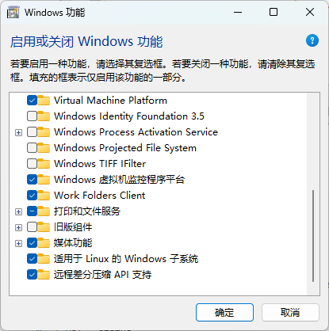
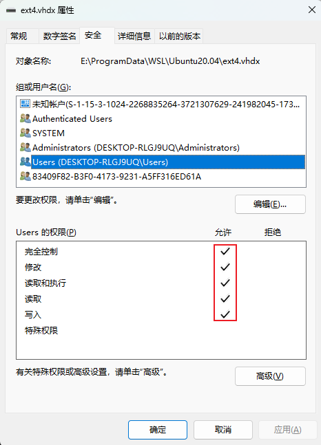
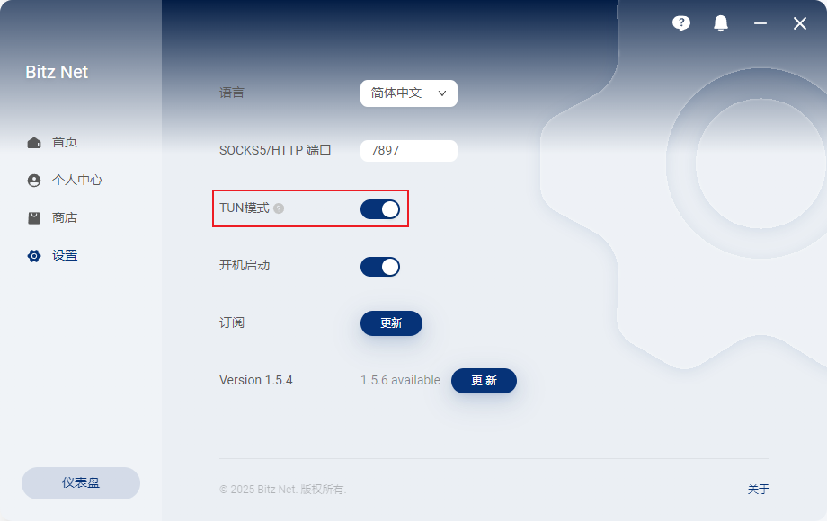

# WSL2->Ubuntu20.04->ROS1（noetic）->PX4->MAVROS

## 安装WSL2

在控制面板 - 程序 - 程序与功能中点击启用或关闭Windows功能，选择

- 虚拟机平台
- 适用于Linux的Windows子系统



在命令提示符中输入以下命令安装WSL2：

```shell
 > wsl --update
 > wsl --status
 默认版本：2
```

- 注意，在此处可能遇到 **已禁止 (403)**的问题，这时需要先去除windows功能中的 **适用于Linux的windows子系统** 这个选项，再进行安装。

## Ubuntu20.04安装

进入微软商店，搜索你需要的Ubuntu版本，点击下载，可以在开始菜单启动Ubuntu，跟着步骤进行用户名称的初始化以及设置密码的流程。

```shell
wsl --help  # 查看帮助
wsl --uninstall Ubuntu-20.04 #卸载Linux系统
wsl --list  #查看当前安装的Linux系统
```

#### 位置迁移

通常wsl会安装在系统盘，`%LOCALAPPDATA%\Packages`目录下的`CanonicalGroupLimited`文件夹，需要将发行版虚拟磁盘移动到你想要的位置，只需要一条命令。

```bash
wsl --manage Ubuntu-20.04 --move [targetDirectory] # 直接移动
```

迁移后，直接启动会报错：


需要更改磁盘权限：



## WSL2 网络环境配置

2023年9月的WSL2更新添加了一些新的实验性功能，其中包括一些关于新的网络模式“镜像”。

更新日志中提到，镜像网络带来的新特性如下：

- [IPv6](https://zhida.zhihu.com/search?content_id=236614875&content_type=Article&match_order=1&q=IPv6&zhida_source=entity)支持
- 在Linux中透过`127.0.0.1`访问Windows服务
- 通过局域网直接连接WSL
- 对虚拟专用网络更好的兼容性
- 多播支持

新的镜像网络使用起来非常方便，最明显的改变是在镜像网络模式下借助**autoProxy=true**配置可以让**WSL直接套用Windows的代理设置**。

我们要做的就是开启WSL2的镜像模式：


同时开启windows 上代理的TUN模式：



这样就可以在WSL2中畅通无阻访问外网。

### sudo apt 命令进度卡住

问题：可以ping通源的域名，如果将windows代理关闭就正常。

> If you are using the http_proxy variable, you need to check whether the **http_proxy** variable continues to be used after running **sudo.** Generally, sudo will clear the environment variables of the common user by default. Previously, I encountered this issue where `sudo curl ip.gs` could not use the proxy due to this reason.
> I eventually solved the issue by modifying the /etc/sudoers file using  `sudo vim` and adding `Defaults env_keep += "http_proxy https_proxy ftp_proxy no_proxy"`, which allowed sudo to use the proxy correctly.

### WSL2访问外部USB设备

https://learn.microsoft.com/zh-cn/windows/wsl/connect-usb

### WSL2备份迁移

https://www.gaoliming.top/posts/433b4ea0.html

## ROS2安装

鱼香ros一行命令（建议把梯子关掉下载）：

```shell
wget http://fishros.com/install -O fishros && . fishros
```

### PX4安装

从github上clone源码

```bash
git clone https://github.com/PX4/PX4-Autopilot.git --recursive
```

进入PX4-Autopilot文件夹，继续下载未下载完的组件

```bash
cd PX4-Autopilot/
git submodule update --init --recursive
```

确保版本最新

```bash
python3 -m pip install --upgrade pip
python3 -m pip install --upgrade Pillow
```

执行ubuntu.sh脚本

```bash
bash Tools/setup/ubuntu.sh
```

如果过程中有安装失败的地方，可以以下命令，直到没有报错：

```bash
bash Tools/setup/ubuntu.sh --fix-missing
```

测试，如果能够打开gazebo即安装成功

```bash
make px4_sitl_default gazebo
```

添加环境变量（添加到~/.bashrc文件中）

```bash
source ~/PX4-Autopilot/Tools/simulation/gazebo-classic/setup_gazebo.bash ~/PX4-Autopilot ~/PX4-Autopilot/build/px4_sitl_default
export ROS_PACKAGE_PATH=$ROS_PACKAGE_PATH:~/PX4-Autopilot
export ROS_PACKAGE_PATH=$ROS_PACKAGE_PATH:~/PX4-Autopilot/Tools/simulation/gazebo-classic/sitl_gazebo-classic
```

接着source

```bash
source .bashrc
```

### 安装MAVROS

```bash
sudo apt-get install ros-noetic-mavros ros-noetic-mavros-extras
```

接着电脑用usb线连接到pxhawk后，在wsl2命令提示符输入：

```bash
ls /dev/tty* 
lsusb
```

确保能识别到接入的设备，并显示/dev/ttyACM0，否则会报错。

```shell
roslaunch mavros px4.launch
```

不报错则成功。

### PX4仿真

```bash
roslaunch px4 mavros_posix_sitl.launch
```

