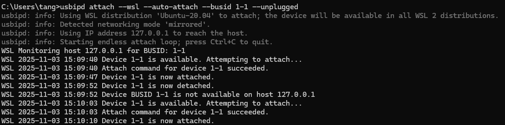

# wsl连接usb设备一些探索

## wsl内部无法使用usbip命令访问usb设备

我们使用wsl访问宿主机上的usb设备时候，需要用到win官方认证的开源项目**usbipd-win**，这个将项目使用核心协议 **USB over IP**，允许USB/IO请求通过TCP/IP网络传输。

然而我遇到一些问题，既然wsl访问usb用到了**USB over IP**，我在使用 `usbip list -r 172.0.0.1`命令后，显示 **USB/IP**没有设备，这就非常奇怪了，按理说 **usbipd-win**使用了上述协议，就应该能够访问到相关设备。与此同时，我们使用 `lsusb`命令就能正常看到挂载在wsl下的usb设备。

> 当 WSL2 运行在新的 镜像模式下时，Windows 主机和 WSL2 虚拟机 (VM) 可以相互连接，使用 （127.0.0.1）作为目标地址，因此不需要使用查询对方的 IP 地址

我经过一番寻找，**似乎**找到了答案。

在当前的场景下，**USB Server**是实际连接USB设备的机器（WIN主机），**USB Client**是需要使用USB设备的机器（WSL2 Linux 虚拟机）。

在经过绑定（Bind），连接（Attach）之后，WSL2 内核上的 USB/IP 客户端驱动程序会在 Linux 内部**创建一个虚拟的 USB 设备**。这个虚拟设备**完全模拟**了 Windows 主机上物理设备的描述符（VID, PID 等）。

也就是说，对于 WSL2 中的 Linux 应用程序来说，这个 USB 设备看起来就像是直接插在 Linux 机器上一样，Linux 驱动程序和应用程序可以像往常一样与设备交互，而**无需知道**底层的数据是通过网络传输的。而`lsusb`命令就是直接向linux内核访问usb设备，所以可以正常查看到相关设备。

## 宿主机usb设备插拔之后需要重复attach

**usbipd-win**最近添加了auto-attach的功能，需要在win主机一直打开一个终端，运行:

```bash
usbipd attach --wsl --auto-attach --busid <busid> --unplugged
```



这样，无论怎么插拔都能自动attach上。
